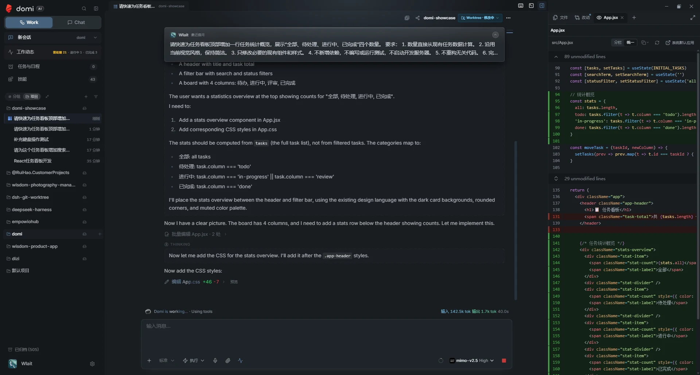
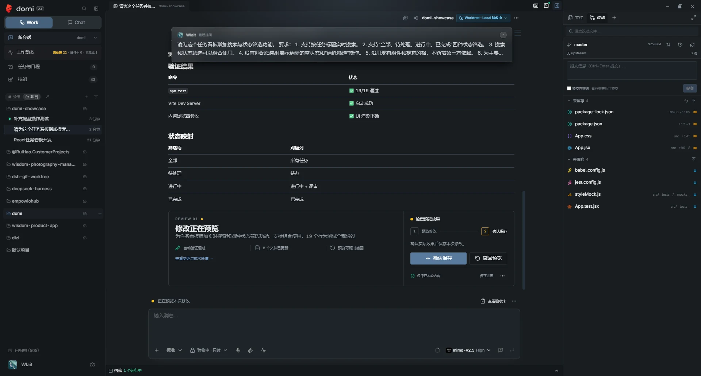
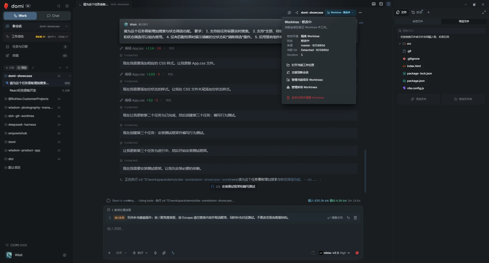

# Domi

[](https://github.com/earendil-works/pi)

Domi 是一个基于开源 [Pi](https://github.com/earendil-works/pi) 的桌面工作台。它把 AI 编程助手、项目文件、终端、Git、内置浏览器、任务与日程放进同一个应用，让你不用在多个工具之间来回切换。Pi 驱动 Work 会话中的智能助手，Domi 则提供桌面界面、项目管理、安全控制，以及从修改代码到确认保存的完整流程。

> Domi 正在快速迭代，首个公开版本线从 **0.20.0** 开始。Windows 与 Linux 预发布安装包通过 GitHub Releases 提供；Domi 不提供自动更新或自动安装，也不会连接第三方产品的发布通道。

[English README](./README.en.md) · [使用教程](./tutorial/tutorial-v2.md) · [工程文档](./docs/README.md) · [贡献指南](./CONTRIBUTING.md)



<p align="center"><sub>助手可以持续处理任务，你也能随时查看它改了哪些文件。</sub></p>

## 核心能力

- **基于 Pi 的编程助手**：[Pi](https://github.com/earendil-works/pi) 可以阅读项目、修改代码、运行测试、启动服务并完成多步骤任务。
- **先研究，或直接执行**：研究模式只查看项目，需要修改时会先征求同意；执行模式可以直接修改并验证。
- **隔离修改，不打扰当前工作**：可为任务创建独立的 Git Worktree 副本，完成后先查看和试用改动，再决定是否保存到原项目。
- **常用 Git 操作内置**：直接查看改动、暂存、提交、同步、切换分支和浏览最近记录。
- **一站式桌面工作区**：文件、草稿、终端、运行中的服务和浏览器都可以同时打开，并在标签间快速切换。
- **持续处理长任务**：任务可以在后台运行；执行过程中还能继续补充要求，也可以把上下文交给新的会话接着做。
- **支持多种模型**：可连接 Anthropic、OpenAI、Google、DeepSeek、Kimi、智谱、MiniMax、豆包、通义千问和兼容端点。
- **数据保存在本机**：会话、配置、扩展、自动任务和日程默认存储在本地，也支持 MCP、Chat HTTP 工具与飞书集成。

## 快速开始

### 环境

需要：

- [Bun](https://bun.sh/)
- Git
- 当前平台可用的 Electron 构建环境

Windows 是当前必过平台；Linux 发布包会在 GitHub Actions 中完成打包与启动检查，macOS 提供手动兼容检查。

### 下载预发布安装包

从 [GitHub Releases](https://github.com/restflux/domi/releases) 下载当前预发布版本：

- **Windows x64**：下载 `Domi-<version>-windows-x64-setup.exe`。当前安装包未签名，Windows SmartScreen 可能显示“Windows 已保护你的电脑”；请先核对 Release 来源与 `SHA256SUMS.txt`，再决定是否继续运行。
- **Linux x64 AppImage**：下载 `Domi-<version>-linux-x64.AppImage`，添加执行权限后运行：`chmod +x Domi-*.AppImage`。
- **Linux x64 Debian/Ubuntu**：下载 `Domi-<version>-linux-x64.deb`，使用系统软件安装器或 `sudo apt install ./Domi-*.deb` 安装。
- **macOS**：目前没有经过真实 Mac 验证的预构建包，请暂时从源码构建。

Domi 不内置自动更新。升级时请重新访问 Releases，并使用随 Release 提供的 `SHA256SUMS.txt` 校验下载文件。

### 从源码运行

```bash
bun install --frozen-lockfile
bun run dev
```

手动拆分开发进程：

```bash
cd apps/electron
bun run dev:vite
# 另一个终端
bun run dev:electron
```

### 构建与测试

```bash
bun test
bun run typecheck
bun run electron:build
```

Windows 本地验证与发布候选包：

```bash
cd apps/electron
bun run dist:win:fast      # 本地快速验证
bun run dist:win:unsigned  # 未签名 Pre-release，正式压缩
bun run dist:win:release   # 配置代码签名后的正式发布
```

`dist:win:fast` 只用于本地验证；公开的未签名安装包必须使用 `dist:win:unsigned` 并明确标为 Pre-release。详见[发布文档](./docs/releasing.md)。

## 用 Domi 完成编程任务

### 先研究，或直接执行

Domi 提供两种工作方式。两者都使用当前系统用户的权限，并不等同于在系统沙箱中运行：

- **研究**：只查看代码、文档和网页，不修改项目。确实需要修改时，Domi 会先征求你的同意，并在本次任务结束后恢复只读状态。
- **执行**：可以直接修改项目、运行命令和检查结果。写回原项目、危险的 Git 操作、对外发布和启用扩展等敏感操作仍会单独确认。

### 隔离修改，不打扰本地代码

Work 会话既可以直接在当前项目中工作，也可以为任务创建一个独立副本（Git Worktree）：

- 助手在独立副本中修改、测试和启动服务，不会覆盖你尚未完成的本地改动；
- 任务进行中可以保存阶段进度，中断后仍可继续；
- 完成后会集中展示改动，方便你逐项检查；
- 你可以先把改动临时放回原项目试用，满意后再保存为一次提交，不满意则安全撤回；
- 冲突检查、任务恢复和副本清理由 Domi 统一处理。



<p align="center"><sub>先在原项目中试用改动，确认无误后再正式保存。</sub></p>

### Git、终端与浏览器

- 在改动面板中查看文件变化，并完成暂存、提交、同步和切换分支等常用 Git 操作；
- 内置终端可以同时运行多个命令，并自动发现本地开发服务的访问地址；
- 内置浏览器让助手在你可见的页面中点击、输入、滚动和读取内容，同时限制它可操作的范围；
- 文件、浏览器、终端和其他工具可以在右侧工作区中同时保持打开。

### 长任务也能接着做

助手工作时，你可以继续补充要求，新要求会排队等待处理，不会打断当前步骤。任务可以在后台运行；内容过长或需要切换项目时，Domi 也能整理已有上下文，并交给新的会话继续完成。



<p align="center"><sub>任务持续执行，追加的要求会按顺序继续处理。</sub></p>

### 安全说明

- Domi 会在运行命令前检查其结构，无法可靠判断时会阻止执行；
- 网页访问会限制私有网络、凭据、跳转和可操作范围，但这不等同于完整的网络沙箱；
- 写回原项目、危险的 Git 操作和对外发布等敏感动作不能绕过确认；
- 你手动打开的终端与助手使用的终端相互隔离。

更完整的架构与安全说明见 [`docs/adr/`](./docs/adr/) 和 [`SECURITY.md`](./SECURITY.md)。

## 本地数据

正式版默认使用 `~/.domi/`，开发版使用 `~/.domi-dev/`：

```text
~/.domi/
├── channels.json
├── conversations.json
├── conversations/
├── agent-sessions.json
├── agent-sessions/
├── agent-workspaces/
├── attachments/
├── planning.db
├── settings.json
└── sdk-config/
```

- 渠道密钥通过 Electron `safeStorage` 加密。
- 会话主要使用 JSON / JSONL；本地规划模块使用 `planning.db`。
- Domi 不会自动读取其他产品的数据目录。旧数据只能通过显式迁移流程导入。
- 项目文件和用户仓库不会被注入产品推广归因。

## Monorepo

Domi 使用 Bun workspace：

```text
domi/
├── apps/
│   ├── cli/            # Domi CLI 与会话渐进式读取
│   └── electron/       # Electron 主进程、Preload、Renderer
├── packages/
│   ├── core/           # Provider adapters 与代码高亮
│   ├── session-core/   # Agent 会话解析与导出真源
│   ├── shared/         # 共享类型、配置和 IPC 常量
│   └── ui/             # 共享 React UI 组件
├── docs/adr/           # 架构决策记录
└── scripts/            # 构建、测试和仓库门禁
```

内部 workspace package 使用 `@domi/*`，当前只作为 monorepo identity，不表示已发布到 npm。

常用入口：

```bash
bun run dev
bun run typecheck
bun test
bun run electron:build
```

修改代码前请阅读 [`AGENTS.md`](./AGENTS.md)、[`CONTEXT.md`](./CONTEXT.md) 和 [`CONTRIBUTING.md`](./CONTRIBUTING.md)。

## 文档

- [Domi 使用教程](./tutorial/tutorial-v2.md)
- [工程文档索引](./docs/README.md)
- [领域语言](./CONTEXT.md)
- [架构决策](./docs/adr/README.md)
- [安全政策](./SECURITY.md)
- [第三方声明](./THIRD_PARTY_NOTICES.md)

## 贡献与安全

欢迎通过 Issue 和 Pull Request 改进 Domi。提交前请运行最相关测试，并在涉及 shared 类型、根配置、打包或跨 package 接口时扩大验证范围。

安全问题请勿提交公开 Issue；请按 [`SECURITY.md`](./SECURITY.md) 使用 GitHub Private Vulnerability Reporting。

## 来源与许可证

Domi 使用开源项目 [Pi](https://github.com/earendil-works/pi) 驱动 AI 编程助手，并在其基础上加入桌面界面、项目管理、安全控制和改动交付流程。

Domi 演进自 [Proma](https://github.com/proma-ai/Proma)，并进行了大量产品、运行时和安全边界改造。上游及后续贡献者的版权分别保留；详细归属见 [`NOTICE`](./NOTICE) 与 [`THIRD_PARTY_NOTICES.md`](./THIRD_PARTY_NOTICES.md)。

本项目采用 [GNU Affero General Public License v3.0](./LICENSE)。使用、修改、分发或通过网络提供修改后的版本时，请遵守 AGPL-3.0 的对应源代码义务。
